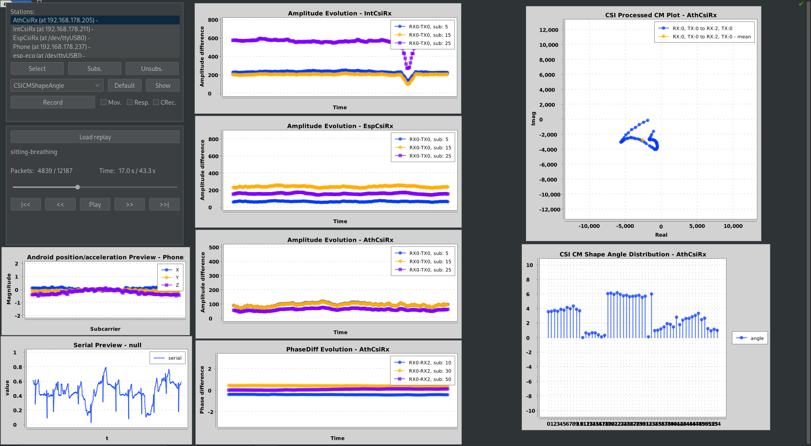

# CSI Client App

This application allows obtaining, processing, previewing, recording and replaying CSI, ECG and acceleration data sent by multiple devices.

It was initially developed as part of my bachelor's thesis and therefore includes code about indoor localization as well as trilateration using RSSI.
The python implementation of the [SpotFi](https://web.stanford.edu/~skatti/pubs/sigcomm15-spotfi.pdf) algorithm was removed from this repository.

The code is designed with software engineering in mind but targeting research and being able to iterate / test quickly. Its base stems from a different project with a completely different goal (indoor localization using atheros devices). It is therefore messy, composed of a lot of different subsystems that may or may not interact and not documented in most cases.

The config files specify location and properties of the stations within a room due to that.

Most of it is tied together by a generic user interface allowing access to different submodules, but some of the functionality might not be integrated with that, while some other legacy functionality of the user interface (like the select button or the respiratory UI) might not work anymore due to changes in the underlying data structures while adding different types of data sources (intel/esp csi, ecg, acceleration, ...).

A preview of the entire application running, previewing Atheros CSI, Intel CSI, ESP CSI, ECG and acceleration data can be seen in the following images. The system can show and record the data in real time, in this case it is being read from a recording. The previews show the android acceleration, ECG data (serial), CSI amplitude for Atheros, Intel and ESP data, the complex conjugate multiplication (CM) shape representation (see report for more details) and its corresponding angle distribution.

A video of the system in operation can be found [here](./doc/PreviewRecording.mp4). You can see the respiratory pattern not present in amplitude or phase data, but in the android acceleration as well as the CM plot as a slight, periodic movement.

## Building
The project uses Java 8+ and should be runnable with every newer version of most JDKs, including OracleJDK and OpenJDK.

Instead of building yourself, a prebuilt application can also be found on the releases page of this repository.

It does not use any build automation and dependency management tool like
Maven or Gradle as it is required to run and be modified on a system not connected
to the internet due to running an access point as well as connecting to a router using
Ethernet. Dependencies therefore need to be added manually.

### Using IntelliJ IDEA
Download the required libraries (as jar files) and put them into the lib folder:
- [Lombok](https://mvnrepository.com/artifact/org.projectlombok/lombok/1.18.20)
- [XChart](https://knowm.org/open-source/xchart/)
- [Gson](https://mvnrepository.com/artifact/com.google.code.gson/gson/2.8.5)
- [Apache Commons Math](https://mvnrepository.com/artifact/org.apache.commons/commons-math3/3.6.1)
- [FlatLaf](https://mvnrepository.com/artifact/com.formdev/flatlaf/0.41)
- [JSerialComm](https://mvnrepository.com/artifact/com.fazecast/jSerialComm/2.6.2)
- [JWave](https://github.com/graetz23/JWave/tree/master/dist)

Import the project into IntelliJ, open module settings by clicking on the root of the project and pressing F4. In the libraries tab, configure each downloaded library and add them to the dependencies of the project in the modules tab.

For using Lombok, you will also have to install the lombok plugin for IntelliJ and enable annotation processing. (Ctrl+Shift+A -> `Plugins` and `Enable annotation processing`)

To run the app, open the CsiUserInterface class and click the run button.

# CSI Server
The [CSI server](https://gitlab.lrz.de/fabian_putterer/csi-server) has to be run on devices generating CSI data. It obtains, processes, filters and forwards CSI data from the local kernel device to any subscribed client.
It can be built using the supplied makefile (`make` and `make x86`). It supports Atheros and Intel CSI on x86 and embedded devices.

To cross compile for embedded devices using a different architecture, a toolchain generated by building the OpenWRT firmware image is required.

# Hardware
This application supports obtaining data from multiple sources at once.

## Atheros CSI
You will need an Atheros device that supports obtaining CSI using 802.11n. This seems to work on wifi chips, newer ones from Qualcomm seem to have this functionality removed. Telling from my testing, all chips compatible with the ath9k driver should be usable as transmitters, as they set the sounding flag, but only supported chips will report CSI back to the driver.

Those include the AR9344, AR9380, AR9580 and AR9462(also known as AR5B22). For more info, see my thesis as well as this [GitHub issue](https://github.com/xieyaxiongfly/Atheros_CSI_tool_OpenWRT_src/issues/35#issuecomment-513397910). Other people have reported the QCA9558 (TP-Link Archer C7 v1-3) to work, the QCA9563 (Archer C7 v4-5) won't work.

I've successfully used the following devices:

| Device   | Type    | Wifi 2.4 | Antennas   | Wifi 5 | Antennas   |
| :------: | :----:  | :------: | :--------: | :---:  | :--------: |
| WR2543ND | router  | AR9380   | 3 external | AR9380 | 3 external |
| WDR4300  | router  | AR9344   | 2 external | AR9580 | 3 external |
| AR5B22   | client  | AR9462   | 2 pins     | AR9462 | 2 pins     |

Other useable devices could be:

| Device      | Type    | Wifi 2.4 | Antennas   | Wifi 5 | Antennas   |
| :------:    | :----:  | :------: | :--------: | :---:  | :--------: |
| WR1043ND v2 | router  | QCA9558  | 3 external | -      | -          |
| Archer C7 v1-3 | router  | QCA9558  | ? | -      | -          |

### Atheros Configuration
To obtain CSI, we need to modify the kernel on those devices and install the [Atheros CSI Tool](https://github.com/xieyaxiongfly/Atheros_CSI_tool_OpenWRT_src).

For PCIe chips like the AR5B22/AR9462, you should use Ubuntu 14.04 with the 4.1.10 kernel, see [Instructions](https://github.com/xieyaxiongfly/Atheros_CSI_tool_OpenWRT_src/wiki/Install-Ubuntu-version-of-Atheros-CSI-tool).

#### Embedded devices
For embedded devices like routers, you'll want to install a modified build of OpenWRT. You can build modified firmware images using the [OpenWRT repo](https://github.com/xieyaxiongfly/Atheros_CSI_tool_OpenWRT_src/wiki/Install-OpenWRT-version-of-Atheros-CSI-tool) of the CSI Tool or use one of the prebuilt images (also found there, not available for some devices, prebuilt images for WDR4300 and WR2543ND here (TODO!!!)).

Those images can then be flashed using the user interface of the factory image (using the image called factory) or by copying the sysupgrade image to the tmpfs of the openwrt installation via ssh and using the `sysupgrade` command. 

Using the web interface (LUCI), the address of the eth interface can be configured. In the wireless settings, one station can be set to access point mode, the other one to client mode. Obtaining CSI should work with encryption en- and disabled.

To send continous traffic to the other device, using ICMP echo packets is recommended. As the built-in `ping` tool has very limited functionality, the fping package, which allows setting individual intervals (e.g. 10ms = 1 / 100 Hz) should be installed. This can be done by connecting the device to a network with internet access or by downloading the package for the correct architecture manually and installing it using `opkg`.

To run the CSI server, copy it to the device using SSH and just execute it, it should automatically detect the `/dev/CSI_dev` device and start reading CSI from it. You can now subscribe to it using the client application.

## Intel CSI

#### CSI server
The Intel CSI tool is not integrated into the CSI Server. You can pipe the stdout of the modified `log_to_file` tool into the stdin of the CSI server though which will cause it to forward any obtained CSI to its subscribers as well (you will have to run `log_to_file` as root).

## ESP CSI

## ESP ECG

## Android acceleration
Android acceleration data can be obtained and shipped to the csi-client-app just like with any other server using the app found at [https://github.com/putterer/accelerometer-server](https://github.com/putterer/accelerometer-server).

# Setup
The devices need to be configured in a way, so that the client app is able to communicate with them. In the case of the Atheros, Intel and Android devices, this is done via UDP/IP, for the ESP's it's done using a serial connection. To edit the network and interface addresses, use the web interface for the OpenWRT based routers and the /etc/network/interfaces file for GNU/Linux based systems.

The network architecture I used can be seen here:

# Configuration
The CSI client app is currently configured by changing the `Config.java` file. There, you can change the stations it is trying to subscribe to, their data types and what processing is applied to them.

The HW address (MAC) should be set, even for devices that do not have one, as it may be used for identifying the station in the serialized recording.

### Proxying Atheros data via SSH
The client / server transmit CSI using UDP so they do not cause an acknowledgement in case the data is sent via the WiFi link used for generating the CSI. This means, some of the data might be lost, which I've seen occuring for Atheros based routers. In case this happens, the obtained CSI data flowing from the csi server to the client can be "proxied" using SSH. This can be done by calling `proxyViaSsh()` on the station in the configuration

This will cause the client to connect to the server's address via SSH, kill any running server, run its own server on the remote device with a command line option, causing it to dump any obtained data into the stdout. This data will then be carried over the SSH connection and get parsed on the client side.

This might cause some delay in obtaining the CSI data, therefore causing an offset in the `clientTimestamp`, but all data should reliably arrive. Additionally, the data contains timestamps from the wifi chip itself, therefore allowing correcting later on.

# Preview / Processing
To start obtaining CSI, just run the application via the CsiUserInterface entry point.
It will open the user interface and automatically start connecting/subscribing to the configured stations until either a timeout occurs or the connection is acknowledged.

You can manually **subscribe** / **unsubscribe** from a station using the buttons, the **Select** button is legacy and doesn't do anything at the moment.

To start previewing live data, select a preview from the drop down, select a station as a a data source and click **Show**. This will open a series of dialogs that allow you to customize the parameters for the preview type. If you want to use the default parameters for all options, you can also just click the **Default** button.

The **Activity** and **Respiratory** tick boxes activate the Activity and Respiratory submodules for the selected station. (Activity is broken at the moment, the respiratory module will work if the `enableRespiratoryUI()` call on the given station  is present in the Config file)

# Recording
To start a recording, click the **Record** button and enter a name for the recording folder. Each arriving CSI packet causes a new file to be created in the recording folder containing the serialized data.

All recording data is compressed using zlib.

To stop the recording, press the button again.

# Replaying
A recording can be selected in the replay UI. This will cause the recording to be loaded and the application to restart (closes all previews).

The application will then behave as if it were receiving the data contained in the recording in real time. All previews and processing modules will operated on the recording's data.

The recording can be controlled using the provided user interface after having been loaded.

## Data format
The recorded data can be loaded externally for investigation, e.g. using an interactive notebook (see the provided notebook for loading CSI, ECG and acceleration data using python).

Before being stored on disk, all data is compressed using zlib. The data is serialized according to the format described in `DataInfo`, `AndroidInfo`, `EcgInfo`, `CSIInfo`, `AthCSIInfo`, `IntCSIInfo`, `EspCSIInfo`. All packets share the same fields from DataInfo, `clientTimestamp` and `messageId`, all CSI packets contain the same data structure for common properties like the CSI matrix. Different devices might store different additional fields like timestamp from the wifi chip, RSSI, noise information, ... .

All recordings contain a `room.cfg` file that specifies the configured stations. When loading, this overrides the stations configured in the application.

# Recording CSI CM shape data
The system is capable to record "images" and "videos" of the complex conjugate multiplication as described in the report for further processing and machine learning purposes. The respective dialog can be opened using the checkbox, samples can then be recorded by using the UI buttons or pressing the respective keyboard buttons for the desired class. 

# Offline processing
The recorded data can be read and replayed for investigation later on. Alternatively, it can be read based on the jupyter notebook python implementations in this repository: TODO!
Code for processing and investigating CSI CM shape data can also be found there.